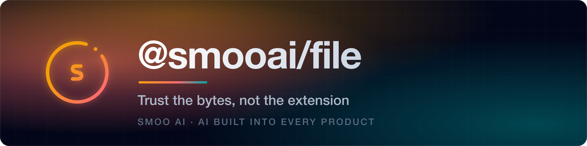
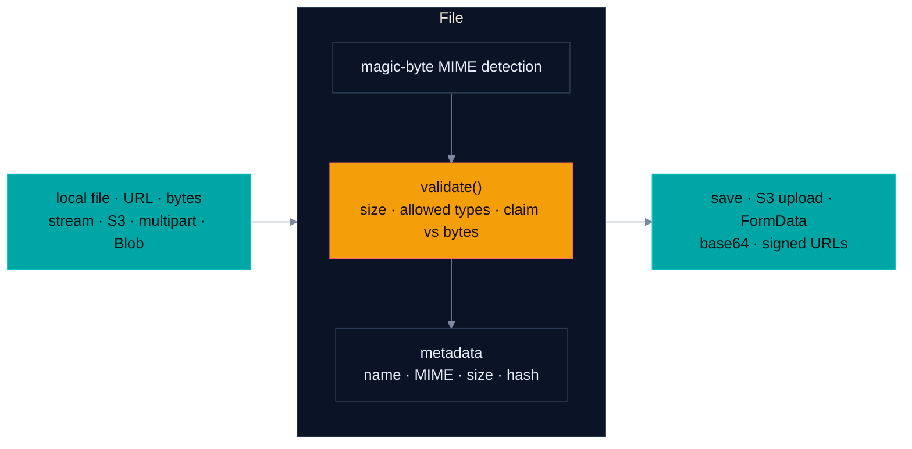

<a name="readme-top"></a>

<p align="center">
  <a href="https://smoo.ai"></a>
</p>

<p align="center">
  <a href="https://www.npmjs.com/package/@smooai/file"></a>
  <a href="https://pypi.org/project/smooai-file/"></a>
  <a href="https://crates.io/crates/smooai-file"></a>
  <a href="https://www.nuget.org/packages/SmooAI.File"></a>
</p>

<p align="center">
  <a href="https://smoo.ai"></a>
  <a href="./LICENSE"></a>
  <a href="https://github.com/SmooAI/file/actions/workflows/release.yml"></a>
</p>

<p align="center">
  <a href="https://www.npmjs.com/package/@smooai/file"></a>
  
  
  
  
  
</p>

<p align="center">
  <a href="#-features"><b>Features</b></a> &nbsp;·&nbsp;
  <a href="#-install"><b>Install</b></a> &nbsp;·&nbsp;
  <a href="#five-languages-honestly"><b>Language status</b></a> &nbsp;·&nbsp;
  <a href="#-usage"><b>Usage</b></a> &nbsp;·&nbsp;
  <a href="#-part-of-smoo-ai"><b>Platform</b></a>
</p>

---

> **A file abstraction that trusts the bytes, not the extension.** Built for backends that take uploads from the open internet: magic-byte MIME detection, size and content validation, and presigned S3 uploads — one `File` API over local files, URLs, streams, S3 objects, and browser uploads, ported natively to **five languages**: TypeScript, Python, Rust, Go, and .NET.

## ✨ Features <a name="features"></a>

|     | Capability                                                 | What you get                                                         |
| --- | ---------------------------------------------------------- | -------------------------------------------------------------------- |
| 🔒  | [**Trust the bytes**](#-trust-the-bytes-not-the-extension) | Magic-byte MIME detection catches spoofed uploads, in all five ports |
| ☁️  | [**S3 in one call**](#️-s3-in-one-call)                     | Upload, download, signed URLs, presigned uploads with size caps      |
| 🌐  | [**One API, many sources**](#-one-api-many-sources)        | Local · URL · bytes · stream · S3 · multipart, one `File` type       |
| 🌊  | [**Lazy streaming**](#-lazy-streaming)                     | Streams ingest without full buffering — Python, Rust, Go, .NET       |
| 📝  | [**Rich metadata**](#-rich-metadata)                       | Detected MIME, size, timestamps, hash — on one object                |

#### 🔒 Trust the bytes, not the extension

Magic-byte MIME detection catches spoofed uploads. A `.php` renamed to `avatar.png` fails validation because the bytes disagree with the claim.

- Magic-byte detection across 100+ file types — in every port
- Validation fails with a **typed error** when the client-claimed MIME disagrees with the bytes, when the file is oversize, or when the type isn't allowed
- One `validate()` call; the errors map cleanly to HTTP 400

The error shape is idiomatic per language: TypeScript and Python throw `FileContentMismatchError` / `FileSizeError` / `FileMimeError` (all extending `FileValidationError`); .NET throws the same three as exceptions; Rust has a `FileValidationError` enum; Go returns one `FileValidationError` with a `Kind` field (`size` · `mime` · `content_mismatch`).

#### ☁️ S3 in one call

- Stream a file into S3 and pull S3 objects back through the same validation pipeline — all five ports
- Presigned upload URLs with `maxSize` baked into the signature, so oversized uploads are rejected by S3 before they hit you — all five ports
- Signed download URLs — all five ports
- In .NET, S3 support is the separate [`SmooAI.File.S3`](https://www.nuget.org/packages/SmooAI.File.S3) package, so .NET consumers who only need detection/validation skip the AWS SDK dependency (the TypeScript package currently ships its AWS SDK dependencies unconditionally)

#### 🌐 One API, many sources

Local filesystem, URL download, S3 object, raw bytes, streams, multipart form uploads, or a browser `File`/`Blob` — all resolve to the same `File` instance with the same validation and metadata surface.

#### 🌊 Lazy streaming

The **Python, Rust, Go, and .NET** ports ingest streams lazily — only a small head is read for MIME sniffing, and the rest of the bytes flow through without buffering the whole file (`from_stream(lazy=True)` · `from_stream_lazy` · `NewFromStreamLazy` · `CreateFromStreamLazyAsync`). The **TypeScript** port does not have lazy streaming yet: reading a file's bytes buffers the content — fine for typical uploads, not for multi-GB files. The honest per-port breakdown is in the [capability matrix](#five-languages-honestly).

#### 📝 Rich metadata

File name, real (detected) MIME type, size, created/modified timestamps, hash/checksum, source type — all on one object.

### How it fits together



## 📦 Install <a name="install"></a>

| Language    | Package                                                           | Install                                    |
| ----------- | ----------------------------------------------------------------- | ------------------------------------------ |
| TypeScript  | [`@smooai/file`](https://www.npmjs.com/package/@smooai/file)      | `pnpm add @smooai/file`                    |
| Python      | [`smooai-file`](https://pypi.org/project/smooai-file/)            | `pip install smooai-file`                  |
| Rust        | [`smooai-file`](https://crates.io/crates/smooai-file)             | `cargo add smooai-file`                    |
| Go          | `github.com/SmooAI/file/go/file/v2`                               | `go get github.com/SmooAI/file/go/file/v2` |
| .NET (core) | [`SmooAI.File`](https://www.nuget.org/packages/SmooAI.File)       | `dotnet add package SmooAI.File`           |
| .NET (S3)   | [`SmooAI.File.S3`](https://www.nuget.org/packages/SmooAI.File.S3) | `dotnet add package SmooAI.File.S3`        |

Language-specific source lives in [`src/`](./src/) (TypeScript), [`python/`](./python/), [`rust/`](./rust/), [`go/`](./go/), and [`dotnet/`](./dotnet/). The .NET port uses [Mime-Detective](https://github.com/MediatedCommunications/Mime-Detective) for magic-byte MIME sniffing.

## Five languages, honestly

Every port carries the core promise: **magic-byte MIME detection, typed size/mime/content-mismatch validation, rich metadata, S3 upload + presigned/signed URLs, and creation from local files, URLs, bytes, streams, S3, and multipart uploads.** Beyond that the surfaces are uneven — here is the verified breakdown, so you know before you pick one:

| Capability                                          |  TypeScript  | Python | Rust | Go  |                             .NET                             |
| --------------------------------------------------- | :----------: | :----: | :--: | :-: | :----------------------------------------------------------: |
| Magic-byte detection + typed `validate()`           |      ✅      |   ✅   |  ✅  | ✅  |                              ✅                              |
| Lazy streaming ingest                               | ❌ (buffers) |   ✅   |  ✅  | ✅  |                              ✅                              |
| Chunked reads (`iter_bytes`)                        |      ❌      |   ✅   |  ✅  | ✅  |                              ❌                              |
| `pipeTo` a writable stream                          |      ✅      |   ❌   |  ❌  | ❌  |                              ❌                              |
| `append` / `prepend` / `truncate`                   |      ✅      |   ✅   |  ❌  | ✅  |                              ❌                              |
| `exists` / `isReadable` / `isWritable` / `getStats` |      ✅      |   ✅   |  ❌  | ❌  |                              ❌                              |
| Upload to S3 + presigned upload URL                 |      ✅      |   ✅   |  ✅  | ✅  | ✅ ([S3 pkg](https://www.nuget.org/packages/SmooAI.File.S3)) |
| Signed download URL                                 |      ✅      |   ✅   |  ✅  | ✅  |                              ✅                              |
| `saveToS3` / `moveToS3` (returns new `File`)        |      ✅      |   ✅   |  ❌  | ❌  |                              ❌                              |
| `downloadFromS3` (S3 → local path)                  |      ❌      |   ✅   |  ✅  | ✅  |                              ❌                              |
| `setMetadata`                                       |      ✅      |   ✅   |  ✅  | ✅  |                              ❌                              |

Same semantics where a capability exists in two ports; each port is written idiomatically for its ecosystem and carries its own test suite.

## 🚀 Usage <a name="usage"></a>

TypeScript below; the same shapes exist per the matrix above in [Python](./python/), [Rust](./rust/), [Go](./go/), and [.NET](./dotnet/).

Jump to a pattern:

- [Basic usage](#basic-usage)
- [Reading and saving](#reading-and-saving)
- [S3 integration](#s3-integration)
- [File type detection](#file-type-detection)
- [FormData support](#formdata-support)
- [Web File / Blob (Hono, Next.js, Browser)](#web-file)
- [Validation (size, mime, content-vs-claim)](#validation)
- [Base64 encoding](#base64)
- [Presigned upload URL](#presigned-upload)

#### Basic usage <a name="basic-usage"></a>

```typescript
import File from '@smooai/file';

// Create a file from a local path
const file = await File.createFromFile('path/to/file.txt');

// Read file contents
const content = await file.readFileString();
console.log(content);

// Get file metadata
console.log(file.metadata);
// {
//   name: 'file.txt',
//   mimeType: 'text/plain',
//   size: 1234,
//   extension: 'txt',
//   path: 'path/to/file.txt',
//   lastModified: Date,
//   createdAt: Date
// }
```

<p align="right">(<a href="#usage">back to usage</a>)</p>

#### Reading and saving <a name="reading-and-saving"></a>

```typescript
import File from '@smooai/file';

// Create a file from a URL
const file = await File.createFromUrl('https://example.com/file.zip');

// Pipe to a destination stream
await file.pipeTo(someWritableStream);

// Read as bytes (note: buffers the content — the TS port has no lazy streaming yet)
const bytes = await file.readFileBytes();

// Save to filesystem
const { original, newFile } = await file.saveToFile('downloads/file.zip');
```

<p align="right">(<a href="#usage">back to usage</a>)</p>

#### S3 integration <a name="s3-integration"></a>

```typescript
import File from '@smooai/file';

// Create from S3
const file = await File.createFromS3('my-bucket', 'path/to/file.jpg');

// Upload to S3
await file.uploadToS3('my-bucket', 'remote/file.jpg');

// Save to S3 (creates new file instance)
const { original, newFile } = await file.saveToS3('my-bucket', 'remote/file.jpg');

// Move to S3 (deletes local file if source was local)
const s3File = await file.moveToS3('my-bucket', 'remote/file.jpg');

// Generate signed URL
const signedUrl = await s3File.getSignedUrl(3600); // URL expires in 1 hour
```

<p align="right">(<a href="#usage">back to usage</a>)</p>

#### File type detection <a name="file-type-detection"></a>

```typescript
import File from '@smooai/file';

const file = await File.createFromFile('document.xml');

// Get file type information (detected via magic numbers)
console.log(file.mimeType); // 'application/xml'
console.log(file.extension); // 'xml'

// File type is automatically detected from:
// - Magic numbers (via file-type)
// - MIME type headers
// - File extension
// - Custom detectors
```

<p align="right">(<a href="#usage">back to usage</a>)</p>

#### FormData support <a name="formdata-support"></a>

```typescript
import File from '@smooai/file';

const file = await File.createFromFile('document.pdf');

// Convert to FormData for uploads
const formData = await file.toFormData('document');

// Use with fetch or other HTTP clients
await fetch('https://api.example.com/upload', {
    method: 'POST',
    body: formData,
});
```

<p align="right">(<a href="#usage">back to usage</a>)</p>

#### Web File / Blob (Hono, Next.js, Browser) <a name="web-file"></a>

```typescript
import File from '@smooai/file';

// Hono multipart route
app.post('/upload', async (c) => {
    const form = await c.req.formData();
    const webFile = form.get('file') as globalThis.File;

    // Preserves the web File's name and type hints.
    const file = await File.createFromWebFile(webFile);
    // …validate, upload, etc.
});
```

<p align="right">(<a href="#usage">back to usage</a>)</p>

#### Validation (size, mime, content-vs-claim) <a name="validation"></a>

```typescript
import File, { FileValidationError } from '@smooai/file';

const file = await File.createFromWebFile(webFile);

try {
    await file.validate({
        maxSize: 5 * 1024 * 1024, // 5MB
        allowedMimes: ['image/png', 'image/jpeg', 'image/webp'],
        expectedMimeType: webFile.type, // compares magic-byte detection vs claimed Content-Type
    });
} catch (err) {
    if (err instanceof FileValidationError) {
        // FileSizeError | FileMimeError | FileContentMismatchError — map to HTTP 400
        throw new HTTPException(400, { message: err.message });
    }
    throw err;
}
```

`expectedMimeType` is the primary defense against mime-spoofing: a `.php` file uploaded with `Content-Type: image/png` will fail because magic-byte detection doesn't match the claim.

<p align="right">(<a href="#usage">back to usage</a>)</p>

#### Base64 encoding (email attachments, data URLs) <a name="base64"></a>

```typescript
import File from '@smooai/file';

const file = await File.createFromUrl('https://s3.example.com/invoice.pdf');

await sendEmail({
    attachments: [
        {
            filename: 'invoice.pdf',
            content: await file.toBase64(),
            encoding: 'base64',
        },
    ],
});
```

<p align="right">(<a href="#usage">back to usage</a>)</p>

#### Presigned upload URL (server signs, client uploads direct to S3) <a name="presigned-upload"></a>

```typescript
import File from '@smooai/file';

// Server issues a time-limited signed URL the client uploads bytes to directly.
// `maxSize` is baked into the signature so oversized uploads are rejected by S3.
const url = await File.createPresignedUploadUrl({
    bucket: Resource.Bucket.name,
    key: `avatars/${userId}.png`,
    contentType: 'image/png',
    expiresIn: 600,
    maxSize: 2 * 1024 * 1024,
});
```

<p align="right">(<a href="#usage">back to usage</a>)</p>

## 🔧 Built with

- TypeScript · Node.js File System API · AWS SDK v3
- [file-type](https://github.com/sindresorhus/file-type) for magic number-based MIME type detection (TypeScript port)
- [Mime-Detective](https://github.com/MediatedCommunications/Mime-Detective) for MIME sniffing (.NET port)
- [@smooai/fetch](https://github.com/SmooAI/fetch) for URL downloads
- [@smooai/logger](https://github.com/SmooAI/logger) for structured logging

## 🧩 Part of Smoo AI <a name="part-of-smoo-ai"></a>

`@smooai/file` is built and open-sourced by **[Smoo AI](https://smoo.ai)** — the AI-powered business platform with AI built into every product: CRM, customer support, campaigns, field service, observability, and developer tools.

- 🧰 **More open source from Smoo AI** — [smoo.ai/open-source](https://smoo.ai/open-source)
- 🧩 **Sibling packages** — [@smooai/fetch](https://github.com/SmooAI/fetch), [@smooai/logger](https://github.com/SmooAI/logger), [@smooai/config](https://github.com/SmooAI/config), [smooth-operator](https://github.com/SmooAI/smooth-operator), [smooth](https://github.com/SmooAI/smooth)

## 🤝 Contributing <a name="contributing"></a>

Contributions are welcome. This project uses [changesets](https://github.com/changesets/changesets) to manage versions and releases.

#### Development workflow

1. Fork the repository
2. Create your branch (`git checkout -b amazing-feature`)
3. Make your changes (the five ports live in `src/`, `python/`, `rust/`, `go/`, `dotnet/`)
4. Add a changeset to document them:

    ```sh
    pnpm changeset
    ```

    You'll be prompted to choose a version bump (patch, minor, or major) and describe the change.

5. Commit your changes (`git commit -m 'Add some amazing feature'`)
6. Push to the branch (`git push origin feature/amazing-feature`)
7. Open a pull request — reference any related issues in the description

The maintainers will review your PR and may request changes before merging.

## 📄 License <a name="license"></a>

MIT — see [LICENSE](./LICENSE).

## 📬 Contact

Brent Rager

- [Email](mailto:brent@smoo.ai)
- [LinkedIn](https://www.linkedin.com/in/brentrager/)
- [BlueSky](https://bsky.app/profile/brentragertech.bsky.social)
- [TikTok](https://www.tiktok.com/@brentragertech)
- [Instagram](https://www.instagram.com/brentragertech/)

Smoo GitHub: [https://github.com/SmooAI](https://github.com/SmooAI)

<p align="right">(<a href="#readme-top">back to top</a>)</p>

---

<p align="center">
  Built by <a href="https://smoo.ai"><strong>Smoo AI</strong></a> — AI built into every product.
</p>
